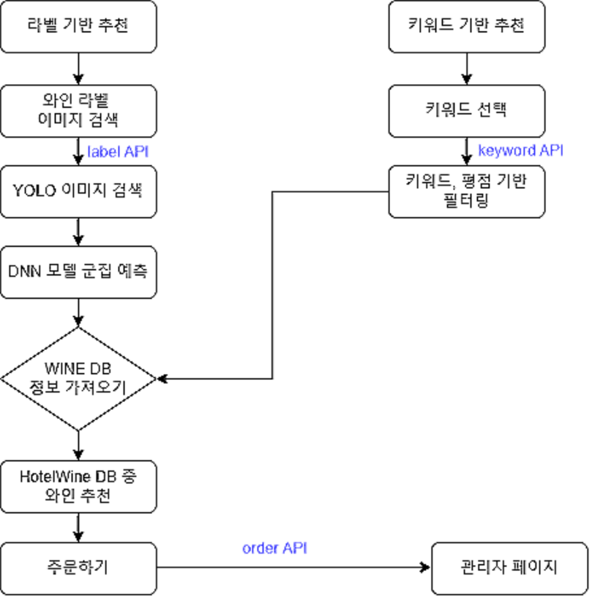

# TM-Wine

<br>

# 과제 개요

## 1. 필요성

- 최근 COVID-19로 인한 거리두기와 MZ세대의 혼술열풍으로 와인 수입량 최대치 기록
- COVID-19로 인해 호캉스에 대한 관심이 높아짐에 따라 와인을 이용하는 고객 증가
- 다양한 와인 종류로 인해 선정에 어려움을 겪는 투숙객들이 상당 수 존재
- 이러한 이유로 AI 기반으로 와인을 추천해주는 시스템의 수요가 존재할 것이다.

<br>

## 2.  주요 기능

### 1. 라벨 기반 와인 추천

- 와인의 라벨 사진을 찍거나 업로드하여 Label image 인식
- 이후 DNN 기반의 군집화 모델을 통하여 인식된 라벨의 군집 계산
- 같은 군집에 속한 와인 중 맛의 지표(당도, 산도, 바디, 타닌) 편차가 가장 작은 두가지 와인 추천 

###  2. 키워드 기반 와인 추천

- 리뷰데이터를 수집하여 자연어처리(KoNLPy)
- 명사 형태소 분석(Mecab) 데이터 시각화
- 데이터, 키워드 매칭

<br>

## 3. 부가 기능

### 1. 오늘의 와인 추천 

- DB상 높은 평점의 와인 중 random으로 추천해주는 서비스 

### 2. 와인 주문하기 서비스

- 추천받은 와인을 주문할 수 있는 서비스
- 관리자 페이지와 연동(https://github.com/Kyoungjinny/TM-Wine-Admin) 하여 주문 확인 및 재고관리 가능 

<br>

## 4. 역할

|   대분류    | 세부 분류       | 참여자                         |
| :---------: | :-------------- | ------------------------------ |
|   **Web**   | Front-End       | 강지훈, 이진욱                 |
|             | Back-End        | 김경진, 박민아                 |
|   **AI**    | AI Cluster      | 김병권, 변재웅, 김병권, 현주우 |
|             | Label Detection | 김경민, 박민아                 |
|             | 자연어 처리     | 강혜원, 김병권, 윤홍주, 이진주 |
| **Support** | 영상 제작       | 강혜원, 이진주, 현주우         |
|             | 산출물 제작     | 강지훈, 김경민, 변재웅, 윤홍주 |

<br>

## 5. 진행 일정

|   날짜    | 일정                             |
| :-------: | :------------------------------- |
|   12/27   | 아이디어 선정 및 프로젝트 구체화 |
|   12/29   | 와인 데이터 수집 및 DB 구축      |
|   12/30   | Web / AI 개발 환경 구축          |
| 12/31-1/2 | 개발 진행                        |
|    1/3    | 테스트 및 에러 디버깅            |
|    1/5    | 발표 준비 및 최종 마무리         |

<br>

## 6. git 

|   폴더    | 설명                                       |
| :-------: | :----------------------------------------- |
|    AI     | 군집화 DNN모델 및 라벨 학습된 Yolov5 model |
|  client   | Front-end files                            |
|   Data    | TM-Wine example data                       |
| documents | 발표 준비 자료                             |
|  Server   | Back-end files                             |

<br><br>

# 과제 내용

## 1. Tech stack & Tool

### - Front-End 

- Framework : React

### - Back-End

- Server : django
- Database : MySQL

### - AI

- Framework : pytorch
- Pacakge : KoNLPy, Mecab

### - Task management

-  Teams, git, notion

<br>

## 2. Installation & Excution

### 1. Front-End

#### (1) Installations 

```objective-c
$ npm init
$ npm install
$ npm run start
```

#### (2) excution

```objective-c
$ npm run start
```

<br>

### 2. Back-End

#### (1) Server setting

- Django setup  

```objective-c
$ pip install django  
$ pip install djangorestframework
$ pip install pillow  
```

- Database setup

  - Create your database  

    ```objective-c
    $ create database 'db_name'  
    ```

  - Create 'mysql.cnf' file in 'Server/tmwine/mysql.cnf'    

    ```
    [client]  
    database = 'db_name'  
    host = localhost  
    user = root  
    password = 'mypassword'  
    ```

  - Adjust models to your database    

    ```objective-c
    $ python manage.py migrate  
    $ python manage.py makemigrations api  
    $ python manage.py migrate  
    ```

    

<br>

## 3. Flow-chart

#### 


